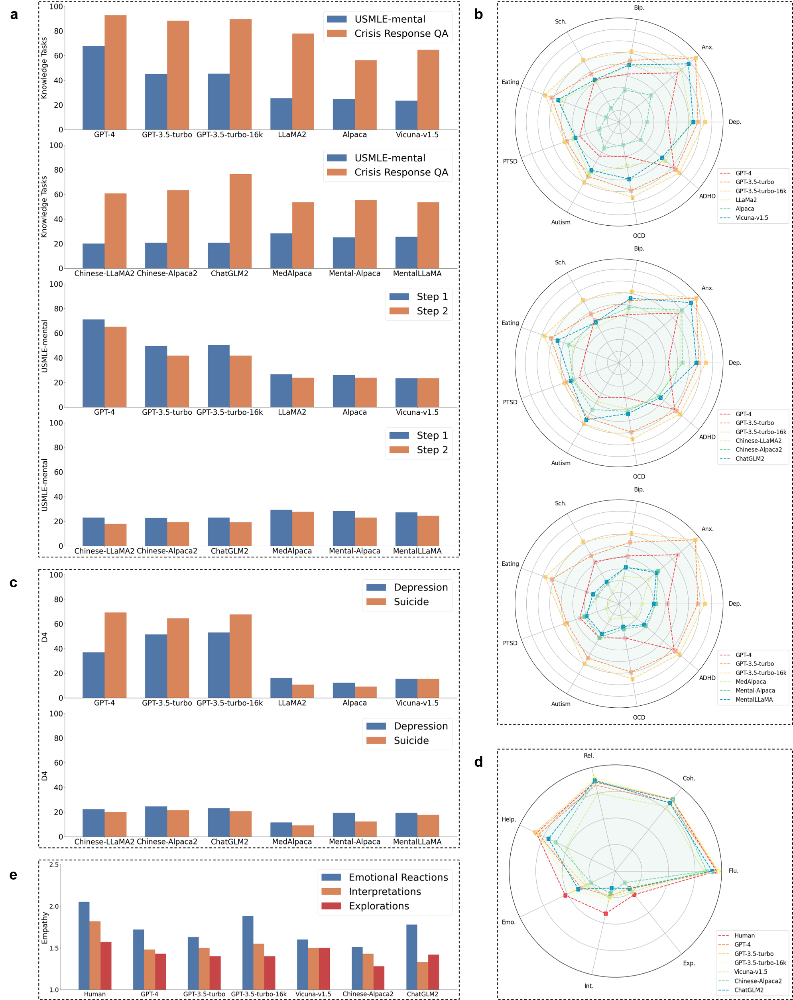

# PsyEval: A Suite of Mental Health Related Tasks for Evaluating Large Language Models

## Overview

PsyEval is a comprehensive task suite designed to evaluate the performance of language models in the domain of mental health. This repository contains the necessary resources and documentation for understanding and replicating our experiments. For more details, please refer to our paper ["PsyEval: A Suite of Mental Health Related Tasks for Evaluating Large Language Models"](https://arxiv.org/abs/2311.09189).

## Dataset

The datasets used in PsyEval include both external and internally constructed data. Below is a detailed description:

### External Datasets

- **MedQA**: A medical question answering dataset available at [MedQA GitHub repository](https://github.com/jind11/MedQA).
- **SMHD**: The Self-reported Mental Health Diagnoses dataset available at [Georgetown University IR Lab](https://ir.cs.georgetown.edu/resources/).
- **D4**: A dataset for disease detection, diagnosis, and description available at [D4 website](https://x-lance.github.io/D4/).
- **PsyQA**: A dataset for psychological question answering available at [PsyQA GitHub repository](https://github.com/thu-coai/PsyQA).

Please review the specific usage policies of each dataset as specified in their respective repositories.

### Internal Datasets

- **USMLE-mental**: 
  To construct the USMLE-mental dataset, we extracted relevant questions from MedQA related to USMLE and identified a list of keywords specific to the mental health domain. Questions were extracted using keyword matching, followed by a manual review to ensure their strong relevance to mental health, resulting in 727 labeled data points focusing on mental health knowledge.

- **Crisis Response QA**: 
  This dataset includes specific questions related to crisis response, expanding its coverage to address mental health crises. The dataset comprises 153 questions curated from authoritative sources, such as the ["Responding to Mental Health Crisis" manual](https://www.theiacp.org/resources/policy-center-resource/mental-illness) and the ["Navigating a Mental Health Crisis" manual](https://www.nami.org/Support-Education/Publications-Reports/Guides/Navigating-a-Mental-Health-Crisis/). Key text was extracted from these materials and transformed into question-answer pairs, followed by GPT-4 generating three fake answers for each question. Medical students reviewed the generated answers to ensure the quality of the dataset.

Please review our [data usage policy](processed/data-usage-policy.md) before using any datasets.

## Experiments

We conducted a series of experiments to evaluate various language models on mental health tasks. Detailed instructions for replicating these experiments can be found in the [Experiments](processed/experiments/) directory.

## Results

The evaluation results for the twelve models in PsyEval are as follows:



For detailed results and analysis, please refer to the paper (["PsyEval: A Suite of Mental Health Related Tasks for Evaluating Large Language Models"](https://arxiv.org/abs/2311.09189)).

## Reference

If you use any source codes or datasets included in this repository in your work, please cite the corresponding papers. The BibTeX entry is listed below:
```
@article{jin2023psyeval,
  title={PsyEval: A Suite of Mental Health Related Tasks for Evaluating Large Language Models},
  author={Haoan Jin, Siyuan Chen, Dilawaier Dilixiati, Yewei Jiang, Mengyue Wu, Kenny Q. Zhu},
  journal={arXiv preprint arXiv:2311.09189},
  year={2023}
}
```